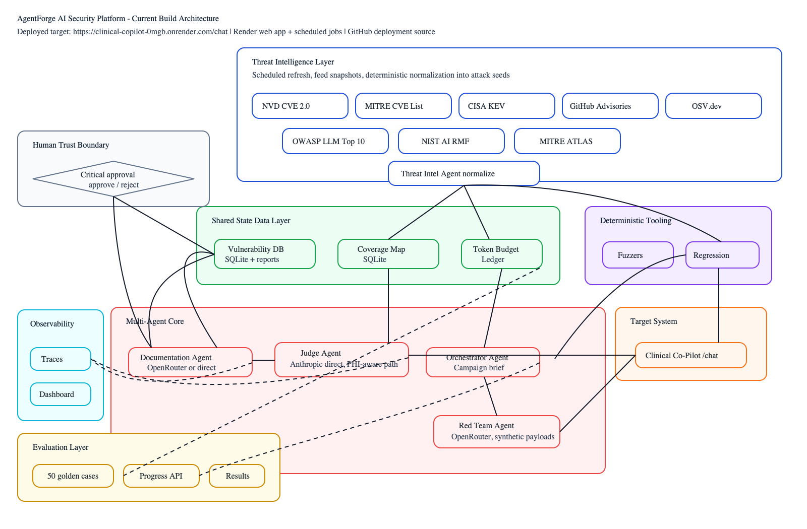

# AgentForge AI Security Platform

AgentForge is a deployable multi-agent adversarial evaluation platform for testing the deployed OpenEMR Clinical Co-Pilot target:

`https://clinical-copilot-0mgb.onrender.com`

This is a separate application, not an OpenEMR fork. It runs authorized adversarial campaigns against an allowlisted target, records independent judge verdicts, generates reviewable vulnerability reports, and keeps uncertain or confirmed findings in a regression loop.

## Current Build State

- Status: MVP build complete and deployed on Render.
- Render Blueprint ID: `exs-d81aqof7f7vs73dfgng0`.
- Render services deployed: `agentforge-ai-security-platform`, `agentforge-weekly-campaign`, `agentforge-threat-intel-refresh`, `agentforge-regression-replay`, and `agentforge-target-probe`.
- Deployment source: GitHub repo `jayceparabellum/agentforge-ai-security-platform`.
- Original Gauntlet GitLab URL: `https://labs.gauntletai.com/jayceparabellum/agentforge-ai-security-platform`.
- Target system: `https://clinical-copilot-0mgb.onrender.com`.
- Local verification: passed on the Mac mini.
- Evaluation status: 50 golden safety cases with 100% suite readiness.
- Smoke campaign: reached the deployed OpenEMR URL with HTTP 200 and generated six reviewable partial findings.
- Target route: red-team payloads are sent only to the allowlisted Clinical Co-Pilot target URL with `TARGET_CHAT_PATH=/chat`.

## What It Does

- Runs authorized adversarial evaluations against `TARGET_ALLOWLIST`.
- Separates responsibilities across Threat Intelligence, Orchestrator, Red Team, Judge, and Documentation agents.
- Refreshes external threat-intelligence feeds from OWASP LLM Top 10, MITRE ATLAS, NIST AI RMF, NVD CVE 2.0, MITRE CVE List, CISA Known Exploited Vulnerabilities, GitHub Advisory Database, and OSV.dev.
- Normalizes fetched threat items into generated adversarial seed cases.
- Stores Layer 1 threat feed items, generated cases, and coverage state in SQLite shared state.
- Maintains a Layer 3 vulnerability database over reports, verdicts, and attack results.
- Maintains a Token Budget Ledger with per-campaign and per-agent estimated spend.
- Runs campaigns through an explicit Layer 2 multi-agent core with typed transition logging.
- Records Layer 2 provider routes: Red Team through OpenRouter, Judge through direct Anthropic, Documentation configurable, and local fallback through Ollama.
- Provides Layer 4 deterministic tooling: fuzzers and regression replay.
- Provides Layer 5 target-system profiling and endpoint probing for the deployed OpenEMR application.
- Provides Layer 6 observability with Langfuse-style traces and coverage dashboard state.
- Provides Layer 7 critical-severity human approval gates.
- Stores agent traces, attack results, verdicts, and report metadata in SQLite.
- Provides a FastAPI dashboard and JSON API for reviewing findings.
- Provides a 50-case golden eval suite with category coverage, quality gates, and `/api/evals/progress`.
- Provides resilient report artifact fallback so checked-in markdown reports remain viewable even when Render recreates runtime SQLite state.
- Ships with a Dockerfile and Render Blueprint config.
- Runs scheduled campaigns weekly by default to control cost.

## Architecture

The implementation follows the supplied architecture model in `assets/architecture-diagram.png`.



The current MVP is provider-agnostic. If model credentials are absent, AgentForge uses deterministic seed mutation and rubric-based judging so the harness remains runnable and reproducible. The intended production routing is now encoded in Layer 2 graph metadata:

- Red Team Agent: OpenRouter-backed open-weight model.
- Judge Agent: direct Anthropic path for consistent independent verdicts and fewer data hops for target responses that may contain PHI.
- Orchestrator Agent: low-cost reasoning model or deterministic prioritizer.
- Documentation Agent: OpenRouter or direct provider for structured report generation.
- Local fallback: Ollama + Dolphin-Llama3.

## Local Setup

```bash
python3 -m venv .venv
source .venv/bin/activate
pip install -r requirements.txt
cp .env.example .env
uvicorn agentforge.app:app --reload
```

Open:

```text
http://127.0.0.1:8000
```

Run tests:

```bash
pytest
```

Run golden eval readiness:

```bash
python -m agentforge.run_evals
```

Run a smoke campaign:

```bash
python -m agentforge.run_campaign --intensity smoke
```

Refresh Layer 1 threat intelligence:

```bash
python -m agentforge.run_threat_intel
```

Run Layer 4 deterministic tooling:

```bash
python -m agentforge.run_layer4 fuzz --max-cases 12
python -m agentforge.run_layer4 regression --intensity smoke
```

Probe the Layer 5 target-system contract:

```bash
python -m agentforge.run_target_probe
```

## Render Deployment

Render deploys this repo through `render.yaml`.

Active Blueprint:

```text
exs-d81aqof7f7vs73dfgng0
```

Deployed Blueprint services:

- `agentforge-ai-security-platform`: web dashboard/API.
- `agentforge-weekly-campaign`: weekly scheduled campaign runner.
- `agentforge-threat-intel-refresh`: scheduled threat-intelligence refresh.
- `agentforge-regression-replay`: scheduled deterministic regression replay.
- `agentforge-target-probe`: scheduled target availability and endpoint contract probe.

Default environment:

```text
TARGET_BASE_URL=https://clinical-copilot-0mgb.onrender.com
TARGET_ALLOWLIST=https://clinical-copilot-0mgb.onrender.com
TARGET_CHAT_PATH=/chat
AGENTFORGE_CAMPAIGN_CADENCE=weekly
CAMPAIGN_BUDGET_USD=2.50
THREAT_INTEL_MAX_GENERATED_CASES=12
NVD_KEYWORD_QUERY=LLM AI machine learning
RED_TEAM_PROVIDER=OpenRouter
RED_TEAM_MODEL=meta-llama/llama-3.3-70b-instruct
JUDGE_PROVIDER=Anthropic direct
JUDGE_MODEL=claude-haiku-4-5
DOCUMENTATION_PROVIDER=OpenRouter or direct
DOC_MODEL=meta-llama/llama-3.3-70b-instruct
LOCAL_FALLBACK_PROVIDER=Ollama + Dolphin-Llama3
```

The default cron schedule is:

```yaml
schedule: "0 6 * * 1"
```

That runs every Monday at 06:00 UTC. Weekly is recommended for the assignment because it gives recurring regression evidence without unnecessary token spend. Biweekly can be configured later if cost becomes more important than regression freshness.

Threat intelligence refresh runs on the 1st and 15th of each month:

```yaml
schedule: "0 5 1,15 * *"
```

Target probing runs weekly before the campaign:

```yaml
schedule: "30 5 * * 1"
```

It checks the allowlisted OpenEMR base URL plus likely Clinical Co-Pilot API paths, stores the target profile and probe results, and marks the integration as `healthy`, `partial`, or `unreachable`.

## Review Workflow

1. The weekly cron starts a scheduled campaign.
2. The Threat Intelligence Agent loads local seeds plus generated external threat-intel seeds.
3. The Orchestrator selects high-priority seed cases.
4. The Red Team Agent creates bounded variants.
5. The target client sends payload sequences to the configured Clinical Co-Pilot endpoint.
6. The Judge Agent issues `pass`, `fail`, or `partial` verdicts using versioned rubrics.
7. The Documentation Agent writes markdown reports for `fail` and `partial` cases.
8. The dashboard shows the review queue, coverage, estimated cost, and agent trace.

## Assignment Deliverables

- `THREAT_MODEL.md`: attack surface map and prioritization summary.
- `ARCHITECTURE.md`: multi-agent architecture, trust boundaries, and diagram.
- `USERS.md`: users, workflows, and automation justification.
- `COST_ANALYSIS.md`: scale-tier cost model.
- `evals/`: seed cases and latest smoke campaign output.
- `evals/golden_cases.json`: 50-case golden adversarial safety eval suite.
- `/api/evals/progress`: golden eval progress, category coverage, quality gates, and readiness percentage.
- `reports/`: vulnerability report queue.
- `schemas/`: typed inter-agent message contracts.
- `agentforge/data/threat_feeds/`: latest external threat feed snapshots.
- `agentforge/data/generated_threat_cases.json`: generated Layer 1 seed cases.
- `/api/threat-intel/state`: shared-state API for Layer 1 feed sources, generated cases, and coverage map.
- `/api/vulnerabilities`: queryable Layer 3 vulnerability database.
- `/api/budget-ledger`: per-agent token and cost ledger.
- `/api/agent-transitions`: Layer 2 graph transition log.
- `/api/provider-routes`: Layer 2 provider/data-hop routing plan.
- `/api/layer4`: deterministic fuzzing and regression replay state.
- `/api/target`: Layer 5 target profile and endpoint probe state.
- `/api/observability`: Layer 6 traces, coverage, verdict, and transition summaries.
- `/api/approvals`: Layer 7 critical-severity approval queue.

## Target Integration Note

The Clinical Co-Pilot application is reachable, and the default chat route is `TARGET_CHAT_PATH=/chat`. Set `TARGET_CHAT_PATH` in Render if the deployed route changes. The MVP intentionally marks incomplete target interactions as `partial` so the platform remains honest and reviewable.
